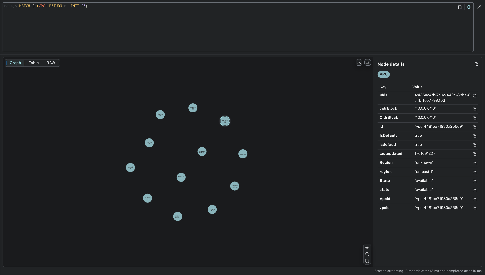

# 雲端基礎設施視覺化分析平台

## 專案概述

本專案是一個基於 **Neo4j 圖形資料庫**的雲端基礎設施分析平台，旨在透過圖形資料模型整合與分析 AWS 等雲端環境中的複雜資源、關聯與依賴關係。系統提供**資安漏洞分析**、**故障衝擊分析**與**成本優化**等功能，並提供互動式視覺化儀表板。

- **視覺化複雜基礎設施**：將雲端資源轉換為易理解的圖形模型
- **智能分析**：自動識別安全風險、故障點和成本浪費
- **即時監控**：提供動態的基礎設施健康度評估
- **決策支援**：為基礎設施優化提供數據驅動的建議

## 圖形資料庫最終報告

### 報告內容
圖形資料庫最終報告，包含以下內容：

1. **Neo4j 產品與服務**: 使用 Neo4j Aura 雲端服務
2. **原始資料格式**: JSON 格式的模擬 AWS 資源資料
3. **圖形資料模型**: 7 種節點類型，4 種關係類型
4. **功能查詢**: 12 個核心 Cypher 查詢，涵蓋三種系統分析功能
5. **系統介面**: 命令行操作和 Neo4j Aura Console 操作範例

### 報告文件
- **Markdown 版本**: `GRAPH_DATABASE_FINAL_REPORT.md`
- **LaTeX 版本**: `Report/final_report.tex`
- **PDF 版本**: `Report/final_report.pdf`

### 系統截圖展示

#### 主儀表板

*系統主頁面 - 顯示整體分析概覽*

#### 三大核心分析功能
<table>
<tr>
<td></td>
<td></td>
<td></td>
</tr>
<tr>
<td align="center">安全性分析結果</td>
<td align="center">故障衝擊分析</td>
<td align="center">成本優化分析</td>
</tr>
</table>

#### Neo4j Aura 雲端資料庫

*Neo4j Aura 雲端資料庫 - 圖形資料儲存和查詢*

#### 節點類型查詢結果
<table>
<tr>
<td></td>
<td></td>
<td></td>
</tr>
<tr>
<td align="center">EC2 實例節點</td>
<td align="center">安全群組節點</td>
<td align="center">VPC 節點</td>
</tr>
<tr>
<td></td>
<td></td>
<td></td>
</tr>
<tr>
<td align="center">子網路節點</td>
<td align="center">EBS 磁碟節點</td>
<td align="center">安全規則節點</td>
</tr>
</table>

#### 關係類型查詢結果
<table>
<tr>
<td></td>
<td></td>
</tr>
<tr>
<td align="center">IS_MEMBER_OF 關係</td>
<td align="center">HAS_RULE 關係</td>
</tr>
<tr>
<td></td>
<td></td>
</tr>
<tr>
<td align="center">LOCATED_IN 關係</td>
<td align="center">ATTACHES_TO 關係</td>
</tr>
</table>

#### 安全性分析查詢結果
<table>
<tr>
<td></td>
<td></td>
</tr>
<tr>
<td align="center">未加密 EBS 磁碟檢測</td>
<td align="center">過度寬鬆的安全群組檢測</td>
</tr>
</table>

#### 成本優化分析查詢結果
<table>
<tr>
<td></td>
<td></td>
</tr>
<tr>
<td align="center">孤兒 EBS 磁碟檢測</td>
<td align="center">未使用的安全群組檢測</td>
</tr>
<tr>
<td colspan="2" align="center"></td>
</tr>
<tr>
<td colspan="2" align="center">已停止的 EC2 實例檢測</td>
</tr>
</table>

#### 故障衝擊分析查詢結果
<table>
<tr>
<td></td>
<td></td>
</tr>
<tr>
<td align="center">關鍵節點識別</td>
<td align="center">單點故障檢測</td>
</tr>
<tr>
<td colspan="2" align="center"></td>
</tr>
<tr>
<td colspan="2" align="center">網路冗餘性分析</td>
</tr>
</table>

### 核心查詢範例

#### 安全分析
```cypher
// 未加密的 EBS 磁碟
MATCH (v:EBSVolume)
WHERE v.encrypted = false
RETURN v.volumeid, v.region, v.state, v.size

// 暴露的安全規則
MATCH (sg:SecurityGroup)-[:HAS_RULE]->(sr:SecurityRule)
WHERE sr.sourcecidr = '0.0.0.0/0' AND sr.direction = 'inbound'
RETURN sg.name, sr.portrange, sr.protocol
```

#### 故障分析
```cypher
// 關鍵節點
MATCH (n)
WITH n, COUNT { (n)--() } as connection_count
WHERE connection_count > 2
RETURN labels(n)[0] AS NodeType, connection_count
ORDER BY connection_count DESC

// 單點故障
MATCH (n)
WITH n, COUNT { (n)--() } as connection_count
WHERE connection_count = 1
RETURN labels(n)[0] AS NodeType
```

#### 成本優化
```cypher
// 孤兒 EBS 磁碟
MATCH (v:EBSVolume)
WHERE NOT (v)-[:ATTACHES_TO]->(:EC2Instance)
RETURN v.volumeid, v.size, v.state

// 未使用的安全群組
MATCH (sg:SecurityGroup)
WHERE NOT (:EC2Instance)-[:IS_MEMBER_OF]->(sg)
RETURN sg.name, sg.groupid
```

---

## 系統架構

### 1. 資料流程架構

```
雲端 API (AWS) → 資料擷取層 → 資料轉換層 → Neo4j 圖形資料庫 → 分析引擎 → 視覺化層
     ↓              ↓              ↓              ↓              ↓           ↓
  Boto3 SDK     AWSExtractor   資料標準化     圖形模型化     Cypher 查詢   Dash 儀表板
```

### 2. 圖形資料模型

#### 節點類型 (Node Types)
- **EC2Instance**: 虛擬伺服器
- **SecurityGroup**: 安全群組（防火牆規則）
- **VPC**: 虛擬私雲
- **Subnet**: 子網路
- **EBSVolume**: 彈性儲存區塊
- **S3Bucket**: Simple  Storage Service
- **LambdaFunction**: 無伺服器運算服務
- **RDSInstance**: 關聯式資料庫
- **ELB**: 彈性負載平衡器

#### 關係類型 (Relationship Types)
- **IS_MEMBER_OF**: EC2 虛擬伺服器屬於的安全群組
- **LOCATED_IN**: 資源位於子網路中
- **ATTACHES_TO**: EBS 磁碟附加到 EC2
- **HAS_RULE**: 安全群組包含規則

---

## 快速開始

### 環境設定

#### 1. 系統需求
- **Python**: 3.8+ (建議 3.9+)
- **Neo4j**: 4.0+ (建議 5.0+)
- **記憶體**: 最少 4GB RAM
- **儲存空間**: 最少 10GB 可用空間

#### 2. 安裝步驟

```bash
# 1. 克隆專案
git clone <repository-url>
cd cloud-infrastructure-analysis

# 2. 創建虛擬環境
python -m venv venv
source venv/bin/activate  # Linux/Mac
# 或
venv\Scripts\activate     # Windows

# 3. 安裝依賴套件
pip install -r requirements.txt

# 4. 設定環境變數
cp .env.example .env
# 編輯 .env 檔案填入您的設定
```

#### 3. Neo4j 設定

```bash
# 方法 1: 使用 Neo4j Desktop
# 1. 下載並安裝 Neo4j Desktop
# 2. 創建新專案
# 3. 啟動資料庫
# 4. 記錄連接資訊

# 方法 2: 使用 Docker
docker run \
    --name neo4j \
    -p 7474:7474 -p 7687:7687 \
    -e NEO4J_AUTH=neo4j/password \
    neo4j:latest
```

### 使用方式

#### 1. 基本命令結構
```bash
python main.py --mode <模式> [選項]
```

#### 2. 推薦使用方式
```bash
# 綜合分析（推薦）
python main.py --mode comprehensive-analyze --mock

# 進階安全分析
python main.py --mode advanced-analyze --analysis-type security --mock

# 成本優化分析
python main.py --mode advanced-analyze --analysis-type cost --mock
```

#### 3. 可用模式

##### 完整流程模式
```bash
# 使用模擬資料（推薦，免費測試）
python main.py --mode full --mock

# 使用真實 AWS 資料（需要 AWS 認證）
python main.py --mode full --provider aws --region us-east-1
```

##### 綜合分析模式（推薦）
```bash
# 執行三大功能完整分析
python main.py --mode comprehensive-analyze
```

##### 📥 資料擷取模式
```bash
# 擷取真實 AWS 資料（需要 AWS 認證）
python main.py --mode extract --provider aws --region us-west-2

# 使用模擬資料（免費測試）
python main.py --mode extract --mock
```

##### 資料載入模式
```bash
# 載入指定資料檔案
python main.py --mode load --data-path data/raw/aws_resources.json

# 載入最新資料
python main.py --mode load
```

##### 分析模式
```bash
# 執行綜合分析（推薦 - 包含三大功能）
python main.py --mode comprehensive-analyze

# 執行傳統安全分析
python main.py --mode analyze

# 執行進階安全分析（基於 Cartography 架構）
python main.py --mode advanced-analyze --analysis-type security

# 執行成本優化分析
python main.py --mode advanced-analyze --analysis-type cost

# 分析結果會儲存到 output/ 目錄
```

##### 儀表板模式
```bash
# 啟動視覺化儀表板
python main.py --mode dashboard --host 0.0.0.0 --port 8050

# 預設地址: http://127.0.0.1:8050
```

---

## 分析功能

### 1. 資安漏洞分析

#### 暴露服務檢測
```cypher
// 找出所有 EC2 實例及其安全群組
MATCH (instance:EC2Instance)-[:IS_MEMBER_OF]->(sg:SecurityGroup)
RETURN instance.name, instance.publicip, sg.name
LIMIT 10
```

#### 安全群組分析
```cypher
// 找出所有安全群組
MATCH (sg:SecurityGroup)
RETURN sg.name, sg.groupid, sg.description
LIMIT 10
```

### 2. 故障衝擊分析

#### 關鍵節點識別
```cypher
// 找出連接數最多的節點（關鍵節點）
MATCH (n)
WITH n, COUNT { (n)--() } as connection_count
WHERE connection_count > 2
RETURN labels(n)[0] as node_type, n.name, connection_count
ORDER BY connection_count DESC
LIMIT 10
```

#### 網路拓撲分析
```cypher
// 分析 VPC 和子網路的結構（使用統一關係類型）
MATCH (vpc:VPC)
OPTIONAL MATCH (subnet:Subnet)-[:LOCATED_IN]->(vpc)
OPTIONAL MATCH (instance:EC2Instance)-[:LOCATED_IN]->(subnet)
RETURN vpc.vpcid, collect(DISTINCT subnet.subnetid) as subnets, 
       collect(DISTINCT instance.name) as instances
```

### 3. 成本優化分析

#### 孤兒資源檢測
```cypher
// 找出未附加到任何實例的 EBS 磁碟
MATCH (volume:EBSVolume)
WHERE NOT (volume)-[:ATTACHES_TO]->(:EC2Instance)
  AND volume.state = 'available'
RETURN volume.volumeid, volume.size, volume.volumetype
ORDER BY volume.size DESC
LIMIT 10
```

#### 未使用安全群組
```cypher
// 找出沒有關聯任何實例的安全群組
MATCH (sg:SecurityGroup)
WHERE NOT (sg)<-[:IS_MEMBER_OF]-(:EC2Instance)
RETURN sg.name, sg.groupid, sg.description
LIMIT 10
```

#### S3 儲存桶分析
```cypher
// 分析 S3 儲存桶資源
MATCH (bucket:S3Bucket)
RETURN bucket.name, bucket.region, bucket.creationdate
ORDER BY bucket.creationdate DESC
LIMIT 10
```

---

## 視覺化儀表板功能

### 1. 互動式網路拓撲圖
- **節點類型視覺化**: 不同顏色代表不同資源類型
- **關係線條**: 粗細表示連接強度
- **即時篩選**: 按環境、團隊、狀態篩選
- **縮放和平移**: 支援大型基礎設施的導航

### 2. 統計圖表
- **資源分布圖**: 圓餅圖顯示資源類型分布
- **成本分析圖**: 柱狀圖顯示各部門成本
- **安全風險圖**: 熱力圖顯示風險分布
- **時間序列圖**: 顯示資源變化趨勢

### 3. 即時監控面板
- **健康度指標**: 整體基礎設施健康度
- **安全評分**: 基於安全規則的評分
- **成本效率**: 資源利用率指標
- **故障風險**: 關鍵節點風險評估

---

## 專案結構

```
cloud-infrastructure-analysis/
├── README.md                    # 專案說明文件
├── requirements.txt             # Python 套件需求
├── .env.example                 # 環境變數範例
├── main.py                      # 主程式入口
├── src/                         # 原始碼目錄
│   ├── data_models.py          # 圖形資料模型定義
│   ├── extractors/             # 資料擷取模組
│   │   ├── __init__.py
│   │   └── aws_extractor.py    # AWS 資料擷取器
│   ├── neo4j_loader/           # Neo4j 載入模組
│   │   └── neo4j_loader.py     # Neo4j 資料載入器
│   ├── analysis/               # 分析模組
│   │   ├── __init__.py
│   │   ├── security_analysis.py      # 資安分析器
│   │   ├── failure_impact_analysis.py # 故障衝擊分析器
│   │   └── cost_optimization.py      # 成本優化分析器
│   ├── rules/                  # 安全規則引擎
│   │   └── security_rules_engine.py
│   ├── extensions/             # 擴展模組
│   │   └── modular_architecture.py
│   └── visualization/          # 視覺化模組
│       ├── __init__.py
│       └── dashboard.py        # 互動式儀表板
├── data/                       # 資料目錄
│   ├── raw/                    # 原始資料
│   │   ├── mock_aws_resources.json
│   │   └── enhanced_mock_aws_resources.json  # 增強版模擬資料
│   └── processed/              # 處理後資料
├── output/                     # 分析結果輸出
│   ├── analysis_results_*.json
│   ├── comprehensive_analysis_*.json  # 綜合分析結果
│   └── advanced_analysis_*.json      # 進階分析結果
├── scripts/                    # 腳本目錄
│   ├── create_mock_data.py     # 模擬資料生成器
│   ├── quick_start.sh          # 快速啟動腳本
│   └── setup_free_testing.sh  # 免費測試環境設定
├── docs/                       # 文件目錄
│   ├── AWS_TERMS.md           # AWS 術語說明
│   └── CYPHER_EXAMPLES.md     # Cypher 查詢範例
├── logs/                       # 日誌目錄
│   ├── cloud_analyzer.log      # 主程式日誌
│   └── error.log              # 錯誤日誌
└── tests/                      # 測試目錄
```

---

## 進階配置

### 1. 自定義分析規則

```python
# 創建自定義安全分析規則
class CustomSecurityAnalyzer(SecurityAnalyzer):
    def find_custom_vulnerabilities(self):
        query = """
        MATCH (instance:EC2Instance)-[:IS_MEMBER_OF]->(sg:SecurityGroup),
              (sg)-[:HAS_RULE]->(rule:Rule)
        WHERE rule.SourceCIDR = '0.0.0.0/0'
          AND rule.PortRange CONTAINS '3389'  # RDP 連接埠
        RETURN instance.Name, instance.PublicIP, rule.PortRange
        """
        return self.execute_query(query)
```

### 2. 自定義視覺化

```python
# 添加自定義圖表
def create_custom_chart(self):
    fig = go.Figure()
    # 添加自定義圖表邏輯
    return fig
```

### 3. 擴展到其他雲端平台

```python
# 添加 GCP 支援
class GCPExtractor:
    def __init__(self, project_id):
        self.project_id = project_id
        self.compute_client = compute_v1.InstancesClient()
    
    def extract_instances(self):
        # GCP 實例擷取邏輯
        pass
```

---

## 故障排除

### 常見問題解決

#### 1. Neo4j 連接問題
```bash
# 檢查 Neo4j 服務狀態
systemctl status neo4j

# 檢查連接埠
netstat -tlnp | grep 7687

# 檢查防火牆
ufw status
```

#### 2. AWS 認證問題
```bash
# 檢查 AWS 憑證
aws sts get-caller-identity

# 設定 AWS 認證
aws configure

# 檢查 IAM 權限
aws iam list-attached-user-policies --user-name your-username

# 使用環境變數設定認證
export AWS_ACCESS_KEY_ID=your-access-key
export AWS_SECRET_ACCESS_KEY=your-secret-key
export AWS_DEFAULT_REGION=us-east-1
```

#### 3. 記憶體不足問題
```python
# 調整批次處理大小
BATCH_SIZE = 100  # 減少批次大小

# 使用分頁查詢
def paginated_query(self, query, page_size=100):
    skip = 0
    while True:
        result = self.execute_query(f"{query} SKIP {skip} LIMIT {page_size}")
        if not result:
            break
        yield result
        skip += page_size
```

---

## 學習資源

### 1. AWS 官方文件
- [AWS EC2 文件](https://docs.aws.amazon.com/ec2/)
- [AWS VPC 文件](https://docs.aws.amazon.com/vpc/)
- [AWS Security Groups 文件](https://docs.aws.amazon.com/AWSEC2/latest/UserGuide/working-with-security-groups.html)

### 2. Neo4j 學習資源
- [Neo4j 官方文件](https://neo4j.com/docs/)
- [Cypher 查詢語言指南](https://neo4j.com/docs/cypher-manual/)
- [圖形資料庫概念](https://neo4j.com/developer/graph-database/)

### 3. Python 相關資源
- [Boto3 AWS SDK](https://boto3.amazonaws.com/v1/documentation/api/latest/index.html)
- [Dash 視覺化框架](https://dash.plotly.com/)
- [Plotly 圖表庫](https://plotly.com/python/)

---

## 授權條款

本專案採用 MIT 授權條款。詳見 [LICENSE](LICENSE) 檔案。

---

## 聯絡資訊

- **作者**: 梁祐嘉
- **學號**: 01157145
- **班級**: 資工 4B
- **課程**: 高等資料庫系統
- **Email**: ch993115@gmail.com

---